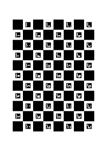

# OpenCV pattern generation tool

Lifted mainly from  [opencv/doc/pattern_tools](https://github.com/opencv/opencv/tree/cbf71c380f5e593263ab9bdc9119fb8d81c30de1/doc/pattern_tools). A really simple way to generate some patterns.


Added some extra utilities like YAML files, loading from YAML files etc

## Installation

```bash
pip install opencv-pattern
```

## Usage

```bash
usage: pattern [-H] [--from_config FROM_CONFIG] [-o OUTPUT] [-c COLUMNS] [-r ROWS] [-T {circles,acircles,checkerboard,radon_checkerboard,charuco_board}]
               [-u {mm,inches,px,m}] [-s SQUARE_SIZE] [-R RADIUS_RATE] [-w PAGE_WIDTH] [-h PAGE_HEIGHT] [-a {A0,A1,A2,A3,A4,A5}]
               [-m MARKERS [MARKERS ...]] [-p ARUCO_MARKER_SIZE] [-f DICT_FILE]

generate camera-calibration pattern

options:
  -H, --help            show help
  --from_config FROM_CONFIG
                        generate pattern from config
  -o OUTPUT, --output OUTPUT
                        output file
  -c COLUMNS, --columns COLUMNS
                        pattern columns
  -r ROWS, --rows ROWS  pattern rows
  -T {circles,acircles,checkerboard,radon_checkerboard,charuco_board}, --type {circles,acircles,checkerboard,radon_checkerboard,charuco_board}
                        type of pattern
  -u {mm,inches,px,m}, --units {mm,inches,px,m}
                        length unit
  -s SQUARE_SIZE, --square_size SQUARE_SIZE
                        size of squares in pattern
  -R RADIUS_RATE, --radius_rate RADIUS_RATE
                        circles_radius = square_size/radius_rate
  -w PAGE_WIDTH, --page_width PAGE_WIDTH
                        page width in units
  -h PAGE_HEIGHT, --page_height PAGE_HEIGHT
                        page height in units
  -a {A0,A1,A2,A3,A4,A5}, --page_size {A0,A1,A2,A3,A4,A5}
                        page size, superseded if -h and -w are set
  -m MARKERS [MARKERS ...], --markers MARKERS [MARKERS ...]
                        list of cells with markers for the radon checkerboard. Marker coordinates as list of numbers: -m 1 2 3 4 means markers in cells
                        [1, 2] and [3, 4]
  -p ARUCO_MARKER_SIZE, --marker_size ARUCO_MARKER_SIZE
                        aruco markers size for ChAruco pattern (default 10.0)
  -f DICT_FILE, --dict_file DICT_FILE
                        file name of custom aruco dictionary for ChAruco pattern
```

## Config

Generates a pattern with the config.

```bash
pattern --from_config /path/to/config
```

## Checkerboard

```bash
pattern -T checkerboard -s 5 -u mm --output checkerboard.svg
```


```yaml
columns: 8
from_config: null
output: checkerboard.svg
p_type: checkerboard
page_size: A4
radius_rate: 5.0
rows: 11
square_size: 5.0
units: mm
```

## Circles


```bash
pattern -T circles -s 5 -u mm --output circles.svg
```


```yaml
columns: 8
from_config: null
output: circles.svg
p_type: circles
page_size: A4
radius_rate: 5.0
rows: 11
square_size: 5.0
units: mm
```

## Acircles

```bash
pattern -T acircles -s 5 -u mm --output acircles.svg
```


```yaml
columns: 8
from_config: null
output: acircles.svg
p_type: acircles
page_size: A4
radius_rate: 5.0
rows: 11
square_size: 5.0
units: mm
```

## Radon checkerboard

```bash
pattern -T radon_checkerboard -s 5 -u mm --output radon_checkerboard.svg
```


```yaml
columns: 8
from_config: null
output: radon_checkerboard.svg
p_type: radon_checkerboard
page_size: A4
radius_rate: 5.0
rows: 11
square_size: 5.0
units: mm
```

## Charuco board


```bash
pattern -T charuco_board --dict_file DICT_ARUCO_ORIGINAL.json.gz --output charuco_board.svg
```

You can either choose one of:

- DICT_4X4_50.json.gz
- DICT_4X4_100.json.gz
- DICT_4X4_250.json.gz
- DICT_4X4_1000.json.gz
- DICT_5X5_50.json.gz
- DICT_5X5_100.json.gz
- DICT_5X5_250.json.gz
- DICT_5X5_1000.json.gz
- DICT_6X6_50.json.gz
- DICT_6X6_100.json.gz
- DICT_6X6_250.json.gz
- DICT_6X6_1000.json.gz
- DICT_7X7_50.json.gz
- DICT_7X7_100.json.gz
- DICT_7X7_250.json.gz
- DICT_7X7_1000.json.gz
- DICT_APRILTAG_16h5.json.gz
- DICT_APRILTAG_25h9.json.gz
- DICT_APRILTAG_36h10.json.gz
- DICT_APRILTAG_36h11.json.gz
- DICT_ARUCO_ORIGINAL.json.gz

or your own personal dict file.



```yaml
aruco_marker_size: 10.0
columns: 8
dict_file: DICT_ARUCO_ORIGINAL.json.gz
from_config: null
output: charuco_board.svg
p_type: charuco_board
page_size: A4
radius_rate: 5.0
rows: 11
square_size: 20.0
units: mm
```